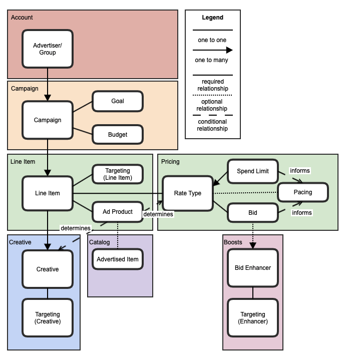

# Welcome to SponsoredContent-Campaign-API Documentation

SponsoredContent-Campaign-API privides the APIs for operatios of campaign. A campaign is a collection of one or more ads, purchased by an advertiser.

# Supporting APIs
https://backstage.expedia.biz/catalog/default/api/SponsoredContent-Campaign-API/definition

## Terminology
A campaign is a collection of one or more line item in order to achieve an advertising goal with a start and end date within a budget, purchased by an advertiser. 

A line item defines an ad product, budget, targeting, rate type, pacing, and bid for an item within a campaign. Campaigns may contain multiple line items.

## High level data structure

  
   

## Important data structures

**Campaign**
| Field | Description |
| -----:|:-----------:|
|id	| string		|
|status| Statues of the campaign, possible states: DRAFT, READY, DELIVERING, COMPLETE, PAUSED|
|create_date_time	| Creating date and time for the campaign|
|last_update_date_time|		Last updated date and time|
|start_date_time|	Start and end dates and time for the campaign|
|end_date_time| If no end date is specified, it is assumed to be an evergreen campaign|
|goal	| The goal customer set for the campaign for example: increase brand conversion by 10%|
|budget|	Starting budget(target money) for this campaign, not real funds|
|line_items| Line items(s) for this campaign|
|version|	 |
|name	| Name of the campaign|
|advertiser_id|	Id will be used to find advertiser contacts and agency contacts.|

**Line item**
| Field | Description |
| :------:|:------:|
|id	|  |
|campaign_id|	Campaign id this line item belong to.|
|status|	Statues of the line item, possible states: DRAFT, READY, DELIVERING, COMPLETE, PAUSED|
|create_date_time	|	Line item creation date and time|
|last_update_date_time|	Line item last update date and time|
|start_date_time|	Start and end dates and time for the line item|
|end_date_time|		If no end date is specified, it is assumed to be an evergreen line item|
|ad_product| Product level categorization of Media Solutions Offerings|
|rate_type|	See reate_type structure|	
|target|	Target	|	
|targeting|	TargetGroup	|	
|target_list|	TargetList	|	
|creatives|	see creative structure|
|remaining_balance|	Remaining amount up to today. At line item level because the add fund should be at line item.|

**Rate type**
| Field | Description |
| :------:|:------:|
| pricing_model|Could be COST_PER_CLICK, COST_PER_ACTION, COST_PER_MILLE |
| spend_limit|Up limit of the total spend for the line item |
|bid | See bid structure|
|pace | See pace structure|

**Ad product**
| Field | Description |
| :------:|:------:|
| ad_product_type | Could be PERFORMANCE, PERFORMANCE_LINKOFF, MARQUEE. |
| advertised_item | Refers to what the advertiser is using MeSo to promote |

**Advertised item**
| Field | Description |
| :------:|:------:|
| product_type | The type of product included in the sponsored content, such as LODGING, AIR, CAR, CRUISE, ACTIVITIES |
|id | TODO: this assumes each piece of inventory can be represented by a single id, not true today |

**Creative**
| Field | Description |
| :------:|:------:|
| id | |
| target | |
| targeting| |
| target_list| |
| marquee_creative | |
| sponsored_listing_creative | |

**Pace**
| Field | Description |
| :------:|:------:|
| time_span | Time span could be DAILY, WEEKLY, MONTHLY |
| strategy | Pacing strategy could be EVENLY or IMMEDIATE |
| amount | Pacing should based on amount of spend limit. |

**Bid**
| Field | Description |
| :------:|:------:|
| bid  | Represents an amount of money with its currency type. |
| bid_enhancers| A bid can have 0 or many bid enhancers |

**Bid enhancer** 
| Field | Description |
| :------:|:------:|
|id | |
|amount | Represents an amount of money with its currency type for the bid enhancer. |
| target | |
| targeting | |
| target_list | |

**Target** 
| Field | Description |
| :------:|:------:|
|id | |
| inclusive | true=inclusive (=) false=exclusive (not !=) For example - Inclusive: include a pool. Exclusive: no kid |
| line_item | See TargetLineItem structure |
| audience_segment | Segment id to be pulled from audience builder|
| page | Current page or a previously viewed page |
| current | The current search or session data |
| previous | Previous search or session data |
| purchased | Previous booked criteria |
| user | User information such as location and membership status |
| device_type | Device type possible vaule: PHONE, TABLET, DESKTOP |

**TargetGroup**
| Field | Description |
| :------:|:------:|
| operator |  |
| target_1 | A single target |
| target_group_1 | A group of targets connected by a logical opererator |
| target_list_1 | A list of elements connected by a single logical operator |
| target_2 | A single target |
| target_group_2 | A group of targets connected by a logical opererator |
| target_list_2 | A list of elements connected by a single logical operator |

**TargetLineItem**
Used for day parting, scheduled ads
| Field | Description |
| :------:|:------:|
| date_start | |
| date_end | |
| time_start | |
| time_end | |
| day_of_week | Support day of week |

**TargetList**
| Field | Description |
| :------:|:------:|
| operator | Logical operator: AND, OR, CONTAINS |
| targets | one or more target|

## Sample use cases
**Display Use Case**
As an advertiser I want to create a 'My Best Campaign' that starts on January 7th, 2022 and ends on February 7th, 2022 to meet my goal of 'Promote Awareness'. I have budgeted $100,000 USD for my campaign. 

I would like to create one order line entry with the following criteria:

I would like to use the Marquee Display ad product to promote my offer.
I would like my ad to appear on expedia.com homepage in the US and for English language speakers.
I would like to budget the full $100,000 of the campaign towards the Marquee and pace it evenly over the course of the campaign.
I am willing to pay $0.50 per mille of impressions (CPM) that I get for this line item.
I will specify a default creative that will apply for the entirety of the campaign.
During the period of February 1st, 2022 and February 7th, 2022, I would like to have a creative that serves specifically to two adults traveling to Seattle.

**Performance Use Case**
As an advertiser I want to create a 'My Best Campaign' that starts on July 20, 2021 and ends on July 20, 2022 to meet my goal of 'Make Money'. I have budgeted $4,000 USD for my campaign. 

I would like to create one order line entry with the following criteria:

The hotel i would like to advertise is the Bates Motel which has a hotel id of 123456 starting on 2021-07-20 and ending on 2021-11-10
I would like to target users is the US,UK,MX, and HU, that have search requests of more than 3 travelers, and have a travel start date in the next 3 days
The budget for my order line is $2,000. I would like this pool of funds can be shared with other order line items if I choose. My spend limit is $1,000 a day
I would like to set a bit of $0.50 and apply a boost of a $1.50 when the partner is Hotels.com (id 1234567) and the search dates are between 2021-10-20 and 2021-10-22
I would like to have two different creatives, one as a default, and one specifically for mobile users

